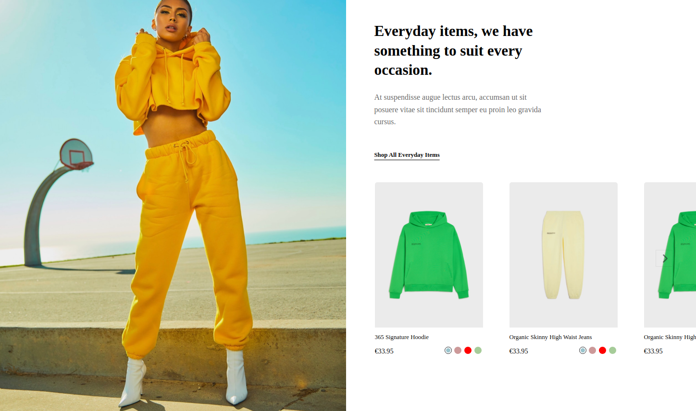
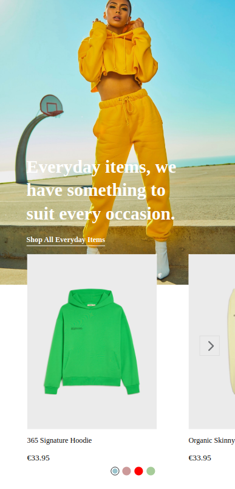

# DigiFist

<h3> DigiFist Task </h3>
<h5>React, Bootstrap</h5>
 

###### Setup and run with nodeJS(v16.16.0):

`npm i && npm start` -  `http://localhost:3000/`
 

###### for test:

`npm test`
 
 

<h6>Repo                : https://github.com/kocak-ilyas/digifist.git</h6>
<h6>Demo                : https://digifist.netlify.app/</h6>

<h6>Linkedin            : https://www.linkedin.com/in/ilyaskocak</h6>
<h6>Gmail               : kocakilyas18@gmail.com </h6>
<h6>GitHub              : https://github.com/kocak-ilyas</h6>

 

###### for Desktop

###### for Mobile:

